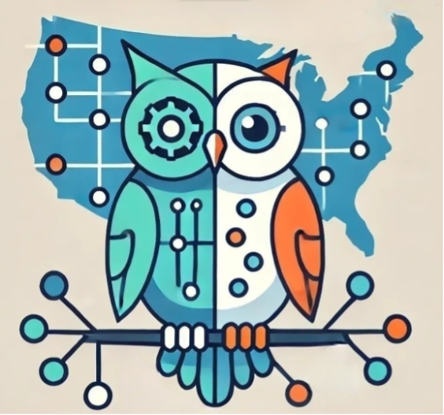

<!-- Improved compatibility of back to top link: See: https://github.com/othneildrew/Best-README-Template/pull/73 -->

<!--
*** Thanks for checking out the Best-README-Template. If you have a suggestion
*** that would make this better, please fork the repo and create a pull request
*** or simply open an issue with the tag "enhancement".
*** Don't forget to give the project a star!
*** Thanks again! Now go create something AMAZING! :D
-->

<!-- PROJECT SHIELDS -->
<!--
*** I'm using markdown "reference style" links for readability.
*** Reference links are enclosed in brackets [ ] instead of parentheses ( ).
*** See the bottom of this document for the declaration of the reference variables
*** for contributors-url, forks-url, etc. This is an optional, concise syntax you may use.
*** https://www.markdownguide.org/basic-syntax/#reference-style-links
-->
[![Contributors][contributors-shield]][contributors-url]
[![Forks][forks-shield]][forks-url]
[![Stargazers][stars-shield]][stars-url]
[![Issues][issues-shield]][issues-url]
[![GNU AGPLv3][license-shield]][license-url]

<!-- PROJECT LOGO -->
 

  

<h3 align="center">KN-Wildlife User Portal</h3>

  

    KN-Wildlife is an NSF-funded project (part of the <a href = "https://www.proto-okn.net/">Proto-OKN program</a>) to provide a centralized hub for ecological occurrence, abundance, and density data. Our system is built upon a Neo4j-powered graphical database of ecological wildlife data. Users can access these data via AI natural language queries (chatbot **IN DEVELOPMENT**) or through manual search options. We also provide options to join data with relevant ecological covariates (bioclimatic, land use/cover, etc... **IN DEVELOPMENT**).
     
    <a href="https://kn-wildlife.crc.nd.edu/"><strong>Visit Portal »</strong></a>
     
     
    <a href="https://github.com/eabrown2378/kn-wildlife-user-portal/issues/new?labels=dataset&template=suggest-dataset---.md">Suggest Dataset</a>
    &middot;
    <a href="https://github.com/eabrown2378/kn-wildlife-user-portal/issues/new?labels=taxonomy&template=taxonomy-fix---.md">Report Taxonomic Error</a>
    &middot;
    <a href="https://github.com/eabrown2378/kn-wildlife-user-portal/issues/new?labels=bug&template=bug-report---.md">Report Bug</a>
    &middot;
    <a href="https://github.com/eabrown2378/kn-wildlife-user-portal/issues/new?labels=enhancement&template=feature-request---.md">Request Feature</a>
  

<!-- TABLE OF CONTENTS -->

  
Table of Contents

  <ol>
    <li><a href="#built-with">Built With</a></li>
    <li><a href="#roadmap">Roadmap</a></li>
    <li><a href="#contributing">Contributing</a></li>
    <li><a href="#license">License</a></li>
    <li><a href="#contact">Contact</a></li>
  </ol>

## Built With

* [![React][React.js]][React-url]
* [![Express][Express.js]][Express-url]
* [![Neo4j][Neo4j]][Neo4j-url]
* [![Leaflet][Leaflet]][Leaflet-url]
* [![Cytoscape.js][Cytoscape.js]][Cytoscape.js-url]

(<a href="#readme-top">back to top</a>)

<!-- ROADMAP -->
## Roadmap

- [ ] Automatically join data with ecological covariates
    - [ ] Bioclimatic data
    - [ ] Land use/cover
    - [ ] Species native/invasive status
- [ ] Incorporate LLM chatbot
    - [ ] Natural language queries
    - [ ] Guidance on data usage and statistical analysis
- [ ] Scale wildlife database (<a href="https://github.com/eabrown2378/kn-wildlife-user-portal/issues/new?labels=dataset&template=suggest-dataset---.md">Suggest Dataset</a>)

See the [open issues](https://github.com/eabrown2378/kn-wildlife-user-portal/issues) for a full list of proposed features (and known issues).

(<a href="#readme-top">back to top</a>)

<!-- CONTRIBUTING -->
## Contributing

Contributions are what make the open source community such an amazing place to learn, inspire, and create. Any contributions you make are **greatly appreciated**.

If you have a suggestion that would make this better, please fork the repo and create a pull request. You can also simply open an issue with the tag "enhancement".
Don't forget to give the project a star! Thanks again!

1. Fork the Project
2. Create your Feature Branch (`git checkout -b feature/AmazingFeature`)
3. Commit your Changes (`git commit -m 'Add some AmazingFeature'`)
4. Push to the Branch (`git push origin feature/AmazingFeature`)
5. Open a Pull Request

(<a href="#readme-top">back to top</a>)

### Top contributors:

<!-- LICENSE -->
## License

Distributed under the GNU AGPLv3. See `LICENSE.txt` for more information.

(<a href="#readme-top">back to top</a>)

<!-- CONTACT -->
## Contact

Ethan Brown - ebrown23@nd.edu

Project Link: [https://github.com/eabrown2378/kn-wildlife-user-portal](https://github.com/eabrown2378/kn-wildlife-user-portal)

(<a href="#readme-top">back to top</a>)

<!-- MARKDOWN LINKS & IMAGES -->
<!-- https://www.markdownguide.org/basic-syntax/#reference-style-links -->
[contributors-shield]: https://img.shields.io/github/contributors/eabrown2378/kn-wildlife-user-portal.svg?style=for-the-badge
[contributors-url]: https://github.com/eabrown2378/kn-wildlife-user-portal/graphs/contributors
[forks-shield]: https://img.shields.io/github/forks/eabrown2378/kn-wildlife-user-portal.svg?style=for-the-badge
[forks-url]: https://github.com/eabrown2378/kn-wildlife-user-portal/network/members
[stars-shield]: https://img.shields.io/github/stars/eabrown2378/kn-wildlife-user-portal.svg?style=for-the-badge
[stars-url]: https://github.com/eabrown2378/kn-wildlife-user-portal/stargazers
[issues-shield]: https://img.shields.io/github/issues/eabrown2378/kn-wildlife-user-portal.svg?style=for-the-badge
[issues-url]: https://github.com/eabrown2378/kn-wildlife-user-portal/issues
[license-shield]: https://img.shields.io/github/license/eabrown2378/kn-wildlife-user-portal.svg?style=for-the-badge
[license-url]: https://github.com/eabrown2378/kn-wildlife-user-portal/blob/master/LICENSE.txt
[product-screenshot]: images/screenshot.png
[React.js]: https://img.shields.io/badge/React-20232A?style=for-the-badge&logo=react&logoColor=61DAFB
[React-url]: https://reactjs.org/
[Express.js]: https://img.shields.io/badge/Express.js-%23404d59.svg?logo=express&logoColor=%2361DAFB
[Express-url]: https://expressjs.com/
[Neo4J]: https://img.shields.io/badge/Neo4j-008CC1?logo=neo4j&logoColor=white
[Neo4J-url]: https://neo4j.com/
[Leaflet]: https://img.shields.io/badge/Leaflet-white?style=flat&logo=leaflet&logoColor=%23199900&logoSize=auto
[Leaflet-url]: https://leafletjs.com/
[Cytoscape.js]: https://img.shields.io/badge/Cytoscape.js-gold?style=flat&logo=cytoscapedotjs&logoColor=black&logoSize=auto
[Cytoscape.js-url]: https://js.cytoscape.org/